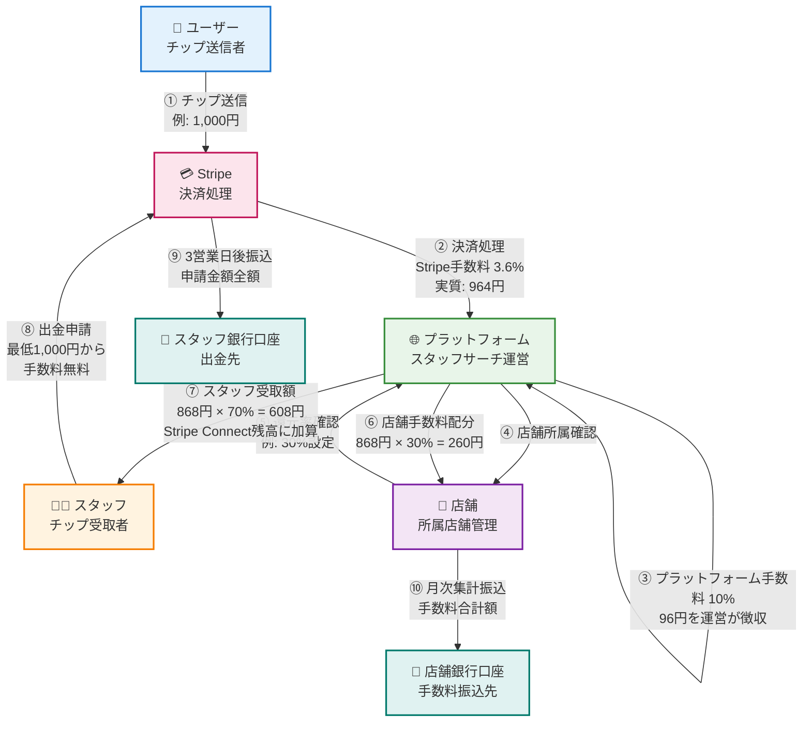
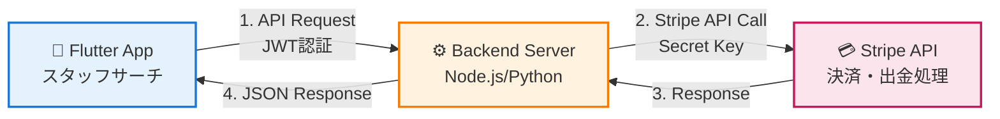
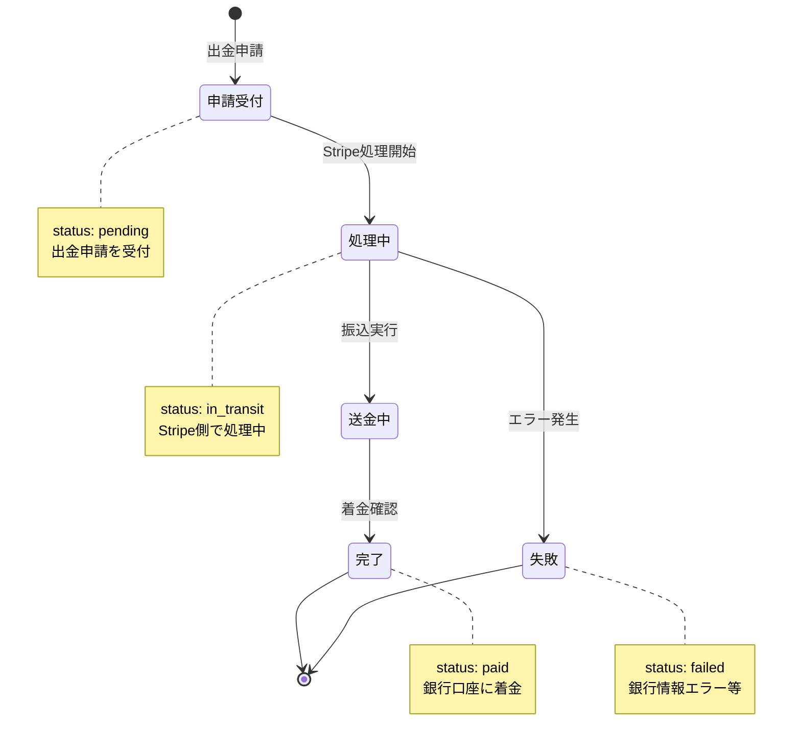

# 💰 スタッフサーチアプリ 金銭フロー図

## 📊 Stripe Connect統合による決済・出金システム

### 🔄 全体金銭フロー



### 📝 金銭フロー詳細説明

#### 1️⃣ **チップ送信フロー**
```
ユーザー → Stripe → プラットフォーム
```
- ユーザーがスタッフにチップを送信（例: 1,000円）
- Stripe決済手数料 3.6%が自動控除（Stripe分: 36円）
- 実質プラットフォーム受取額: 964円

#### 2️⃣ **プラットフォーム手数料**
```
プラットフォーム受取額 × 10% = プラットフォーム収益
```
- 964円 × 10% = 96円（プラットフォーム手数料）
- 残り: 868円（スタッフ・店舗への分配原資）

#### 3️⃣ **店舗手数料配分（所属スタッフの場合）**
```
(プラットフォーム受取額 - 手数料) × 店舗還元率 = 店舗収益
```
- **フリーランススタッフ**: 店舗還元率 0% → 全額スタッフへ
- **所属スタッフ**: 店舗還元率設定（0〜100%）に応じて分配
  - 例: 還元率30%の場合
  - 店舗: 868円 × 30% = 260円
  - スタッフ: 868円 × 70% = 608円

#### 4️⃣ **スタッフ出金フロー**
```
スタッフ → 出金申請 → Stripe → 銀行口座（3営業日）
```
- **最低出金額**: 1,000円
- **最大出金額**: 1,000,000円/回
- **出金手数料**: 無料
- **処理期間**: 3営業日
- **申請締切**: 平日15時まで（当日処理）

---

## 💵 具体的な金額計算例

### ケース1: フリーランススタッフ（店舗所属なし）

| 項目 | 金額 | 計算式 |
|------|------|--------|
| ユーザー送信額 | 1,000円 | - |
| Stripe手数料 (3.6%) | -36円 | 1,000 × 0.036 |
| プラットフォーム受取額 | 964円 | 1,000 - 36 |
| プラットフォーム手数料 (10%) | -96円 | 964 × 0.10 |
| 店舗手数料 | 0円 | 店舗所属なし |
| **スタッフ受取額** | **868円** | 964 - 96 |

### ケース2: 所属スタッフ（還元率30%設定）

| 項目 | 金額 | 計算式 |
|------|------|--------|
| ユーザー送信額 | 1,000円 | - |
| Stripe手数料 (3.6%) | -36円 | 1,000 × 0.036 |
| プラットフォーム受取額 | 964円 | 1,000 - 36 |
| プラットフォーム手数料 (10%) | -96円 | 964 × 0.10 |
| 分配原資 | 868円 | 964 - 96 |
| 店舗手数料 (30%) | 260円 | 868 × 0.30 |
| **スタッフ受取額** | **608円** | 868 × 0.70 |

### ケース3: 所属スタッフ（還元率50%設定）

| 項目 | 金額 | 計算式 |
|------|------|--------|
| ユーザー送信額 | 1,000円 | - |
| Stripe手数料 (3.6%) | -36円 | 1,000 × 0.036 |
| プラットフォーム受取額 | 964円 | 1,000 - 36 |
| プラットフォーム手数料 (10%) | -96円 | 964 × 0.10 |
| 分配原資 | 868円 | 964 - 96 |
| 店舗手数料 (50%) | 434円 | 868 × 0.50 |
| **スタッフ受取額** | **434円** | 868 × 0.50 |

---

## 🔐 Stripe Connect統合仕様

### システムアーキテクチャ



### API エンドポイント設計

#### 1. アカウント作成・接続
```http
POST /api/stripe/connect/account
Content-Type: application/json
Authorization: Bearer {JWT_TOKEN}

{
  "email": "staff@example.com",
  "country": "JP"
}

Response:
{
  "success": true,
  "account_id": "acct_xxxxxxxxxxxxx",
  "onboarding_url": "https://connect.stripe.com/setup/..."
}
```

#### 2. 残高確認
```http
GET /api/stripe/balance?user_id={USER_ID}
Authorization: Bearer {JWT_TOKEN}

Response:
{
  "available": 45000,
  "pending": 12000,
  "currency": "jpy"
}
```

#### 3. 出金申請
```http
POST /api/stripe/payouts
Content-Type: application/json
Authorization: Bearer {JWT_TOKEN}

{
  "user_id": "staff_001",
  "amount": 10000,
  "currency": "jpy"
}

Response:
{
  "success": true,
  "payout_id": "po_xxxxxxxxxxxxx",
  "arrival_date": "2026-03-16T00:00:00Z",
  "message": "出金申請を受け付けました"
}
```

#### 4. 出金履歴取得
```http
GET /api/stripe/payouts/history?user_id={USER_ID}&limit=20
Authorization: Bearer {JWT_TOKEN}

Response:
{
  "payouts": [
    {
      "id": "po_xxxxxxxxxxxxx",
      "amount": 10000,
      "status": "paid",
      "arrival_date": "2026-03-13T00:00:00Z",
      "created_at": "2026-03-10T10:30:00Z"
    }
  ]
}
```

#### 5. 銀行口座登録
```http
POST /api/stripe/bank_accounts
Content-Type: application/json
Authorization: Bearer {JWT_TOKEN}

{
  "user_id": "staff_001",
  "account_holder_name": "山田太郎",
  "bank_name": "三菱UFJ銀行",
  "branch_name": "新宿支店",
  "account_type": "savings",
  "account_number": "1234567"
}

Response:
{
  "success": true,
  "bank_account_id": "ba_xxxxxxxxxxxxx"
}
```

---

## 📋 出金ルール詳細

### 基本ルール

| 項目 | 内容 |
|------|------|
| 最低出金額 | 1,000円 |
| 最大出金額 | 1,000,000円/回 |
| 出金手数料 | 無料（Stripeが負担） |
| 処理期間 | 3営業日 |
| 申請受付 | 平日15時まで（当日処理） |
| 振込先 | 登録済み銀行口座 |

### 注意事項

1. **本人確認必須**
   - Stripe Connect本人確認完了後に出金可能
   - 未完了の場合は出金申請不可

2. **営業日カウント**
   - 土日祝日は営業日にカウントされない
   - 土日申請は翌営業日処理

3. **店舗所属スタッフ**
   - 還元率に応じた金額が出金可能
   - 店舗手数料分は別途店舗口座へ振込

4. **最小出金制限**
   - 残高1,000円未満は出金不可
   - 複数回のチップを貯めてから出金推奨

---

## 🔄 状態遷移図

### 出金ステータス遷移



---

## 🛡️ セキュリティ対策

### 1. API認証
- JWT (JSON Web Token) による認証
- アクセストークンの有効期限: 1時間
- リフレッシュトークンで自動更新

### 2. データ暗号化
- 銀行口座情報はStripe側で暗号化保存
- アプリ側には下4桁のみ表示

### 3. 不正防止
- 出金上限額設定（1,000,000円/回）
- 短時間での連続出金申請を制限
- 異常な残高増加を検知・アラート

### 4. ログ監視
- 全出金申請をログ記録
- 異常パターン検知システム
- 管理者ダッシュボードでリアルタイム監視

---

## 📊 管理者向けダッシュボード

### 金銭フロー監視指標

1. **日次集計**
   - チップ総額
   - プラットフォーム手数料収益
   - 店舗手数料総額
   - スタッフ出金総額

2. **月次レポート**
   - ユーザー別チップランキング
   - スタッフ別受取ランキング
   - 店舗別手数料収益
   - 出金成功率・失敗率

3. **アラート設定**
   - 異常な高額出金申請
   - 連続出金申請検知
   - Stripe API エラー通知
   - 残高不整合検知

---

## 🚀 実装チェックリスト

### Flutter App側
- [x] Stripe Connect Service実装
- [x] 出金申請画面（StaffPayoutScreen）
- [x] 残高表示機能
- [x] 出金履歴表示
- [x] 出金ルール表示
- [x] エラーハンドリング

### Backend側（今後実装）
- [ ] Stripe Connect API統合
- [ ] JWT認証システム
- [ ] 出金申請APIエンドポイント
- [ ] 残高確認APIエンドポイント
- [ ] 銀行口座登録API
- [ ] Webhook処理（出金完了通知）
- [ ] 管理者ダッシュボード

### インフラ・運用
- [ ] Stripe本番環境アカウント作成
- [ ] Secret Key/Publishable Key設定
- [ ] Webhook URL設定
- [ ] 監視・ログシステム
- [ ] バックアップ体制

---

## 📞 サポート・問い合わせ

### スタッフ向けサポート
- **出金トラブル**: ヘルプ&サポート画面から問い合わせ
- **銀行口座変更**: プロフィール設定から変更可能
- **本人確認**: Stripe Connect本人確認リンクから手続き

### 管理者向けサポート
- **Stripe管理画面**: https://dashboard.stripe.com/
- **API ドキュメント**: https://stripe.com/docs/api
- **緊急連絡先**: support@staffsearch.app

---

**作成日**: 2026年3月13日  
**バージョン**: 1.0  
**更新履歴**: 初版作成
